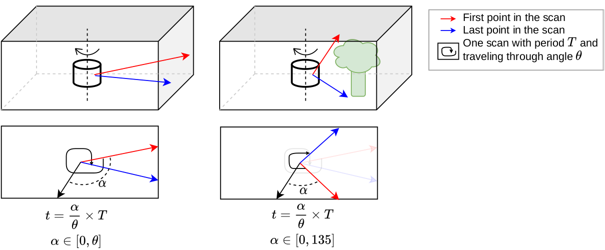
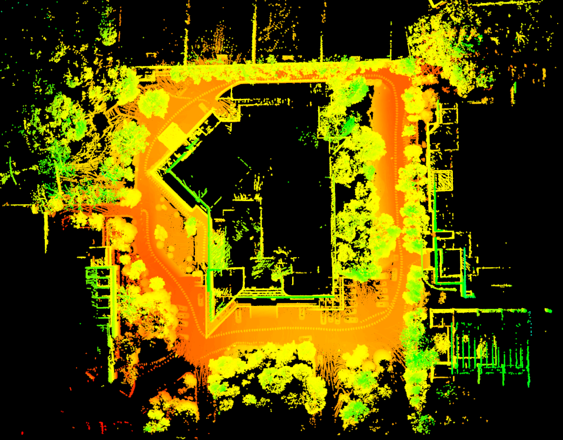
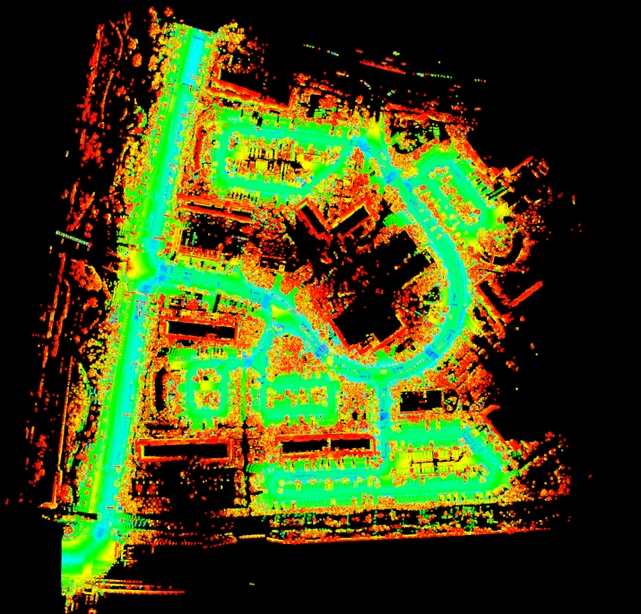

# clins

CLINS : Continuous-Time Trajectory Estimation for LiDAR-Inertial System

**CLINS** is a highly-accurate continuous-time trajectory estimation framework dedicated for SLAM (Simultaneous Localization and Mapping) applications, which enables fuse high-frequency and asynchronous sensor data effectively. Now CLINS is applied in a 3D LiDAR-inertial system for evaluations.

## Dependency

- [**Sophus**](https://github.com/NikolausDemmel/Sophus/tree/eaf1e404992675a42892fa648d69d5bd933ff219) (Required by [basalt-headers](https://gitlab.com/VladyslavUsenko/basalt-headers))
- **Ceres**
- **yaml-cpp**

As a SLAMer, we are confident that you have the ability to solve the dependency by yourself.

## Build

```shell
# clone clins into your catkin workspace
git clone https://github.com/APRIL-ZJU/clins.git

catkin_make
```

## Examples

### 0. Recover timestamp

Some public datasets do not provide a timestamp for each point in the scan. We tried to recover the exact timestamp of each point. The method shown below is adopted in LOAM however it is not suitable when the scan is incomplete. We refer readers to the `src/node/recovery_vlp16_timestamp.cpp` for details.



### 1. Indoor Dataset from lio-mapping

The lidar msg in the [original datasets](https://drive.google.com/drive/folders/1dPy667dAnJy9wgXmlnRgQZxQF_ESuve3) does not have the `time` filed, we recover each point' timestamp of the scan and available [here](https://drive.google.com/drive/folders/17OVuXPaoZQ-xYqHJDlfAlfqoDUkqOq6o?usp=sharing).

Before you launch the file, **check** the `bag_path` in the configuration file.

```shell
# Run the launch file:
roslaunch clins clins_offline.launch config_name:=/config/liom-bag.yaml
```

### 2. [Our own Dataset](https://drive.google.com/drive/folders/17OVuXPaoZQ-xYqHJDlfAlfqoDUkqOq6o)

Before you launch the file, **check** the `bag_path` in the configuration file.

```shell
# Run the launch file:
roslaunch clins clins_offline.launch config_name:=/config/yq-data.yaml
```



### 3. [Dataset from lio-sam](https://drive.google.com/drive/folders/17OVuXPaoZQ-xYqHJDlfAlfqoDUkqOq6o)

Before you launch the file, **check** the `bag_path` in the configuration file.

```shell
# Run the launch file:
roslaunch clins clins_offline.launch config_name:=/config/lio-sam-bag.yaml
```

###  4. [KAIST Complex Urban Dataset](https://drive.google.com/drive/folders/17OVuXPaoZQ-xYqHJDlfAlfqoDUkqOq6o)

Before you launch the file, **check** the `bag_path` in the configuration file.

```shell
# Run the launch file:
roslaunch clins clins_offline.launch config_name:=/config/kaist.yaml
```

The estimated trajectory is saved in the directory of the provided dataset. Modify the parameters `trajectory_path`, `bag_path`, and `save_cloud_path` in `kaist_sick_map_generation.launch`, then run it!

```shell
# use the estimated trajectory to generate map with 2D LiDAR data from SICK LMS-511
roslaunch clins kaist_sick_map_generation.launch
```

You will get the following reconstruction result.



## Run with your own data

All the above sequences are collected by VLP-16.

Note that `ring` field is required for cloud feature extraction. `time` field is required for undistortion. Make sure the lidar topic (`sensor_msgs/PointCloud2 `) has both `ring` and `time` fields.

## Credits

This code was developed by the [APRIL Lab](https://april.zju.edu.cn/) in Zhejiang University.

For researchers that have leveraged or compared to this work, please cite the following:

Jiajun Lv, Kewei Hu, Jinhong Xu, Yong Liu, Xingxing Zuo. CLINS : Continuous-Time Trajectory Estimation for LiDAR-Inertial System. IROS 2021. [[arxiv](https://arxiv.org/pdf/2109.04687.pdf)]

The lidar feature extraction is heavily derived from [LIO-SAM](https://github.com/TixiaoShan/LIO-SAM). The continuous-time trajectory is taken from [basalt](https://gitlab.com/VladyslavUsenko/basalt-headers).

## TODO

- [ ] LiDAR odometry saves all lidar scan which is slow for large dataset.
- [ ] Support livox LiDAR.
- [ ] Marginalization LiDAR feature and IMU measurement.
- [ ] Speed up (analytic factor).

