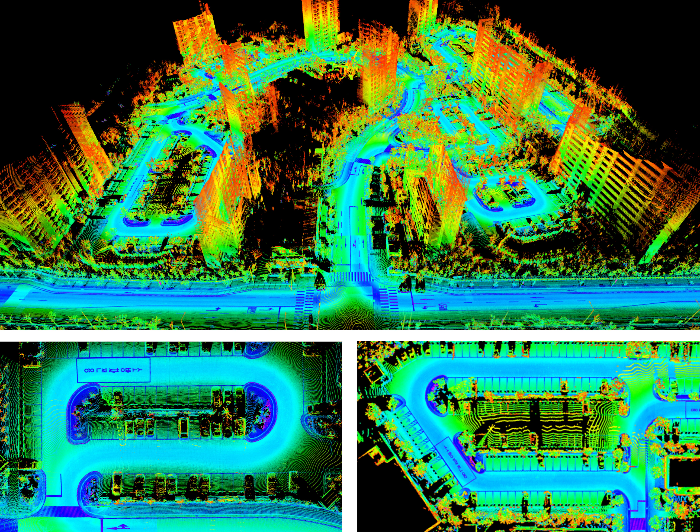
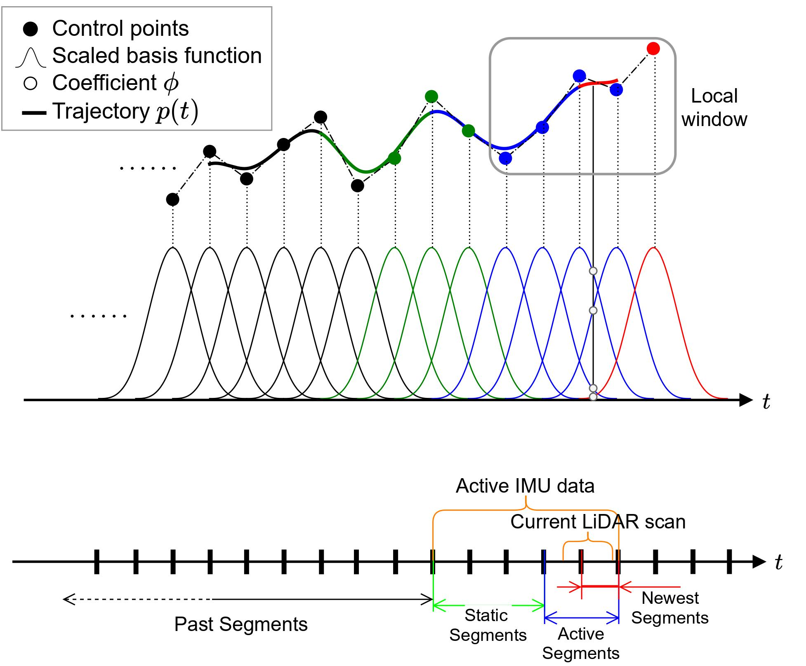
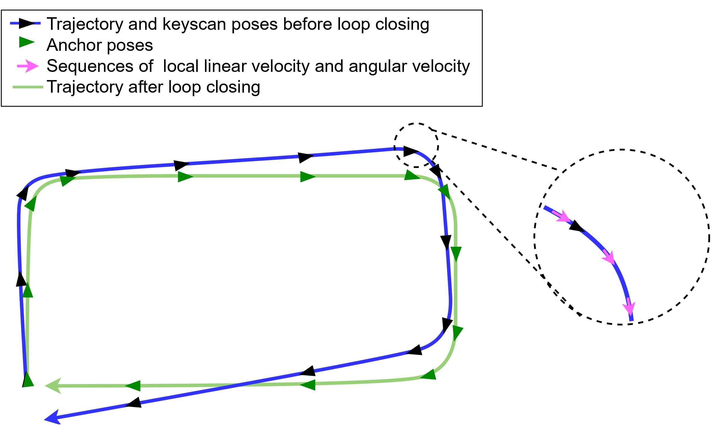
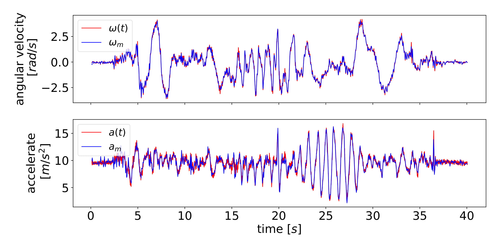
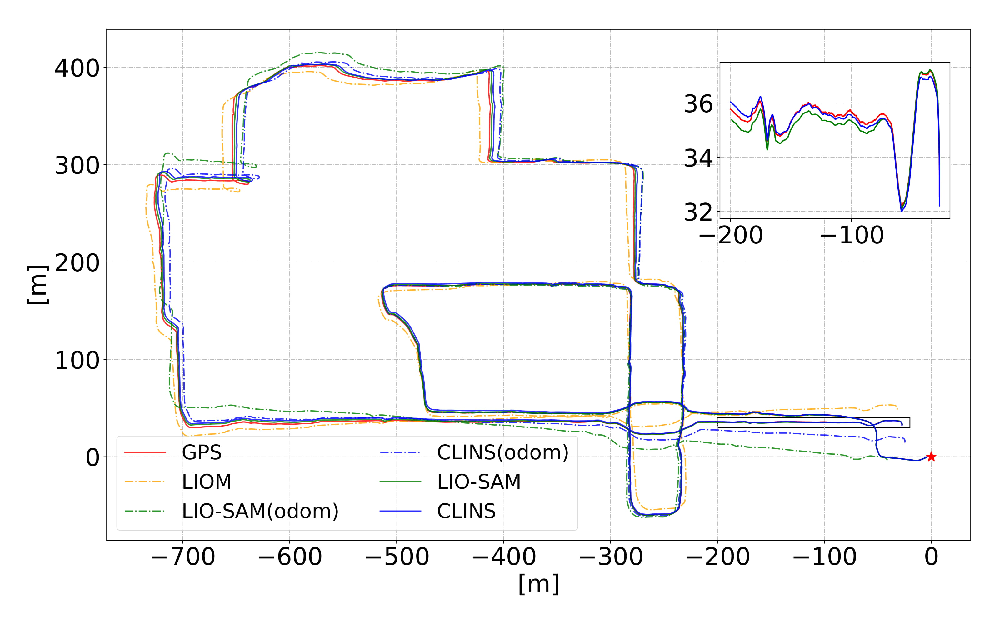
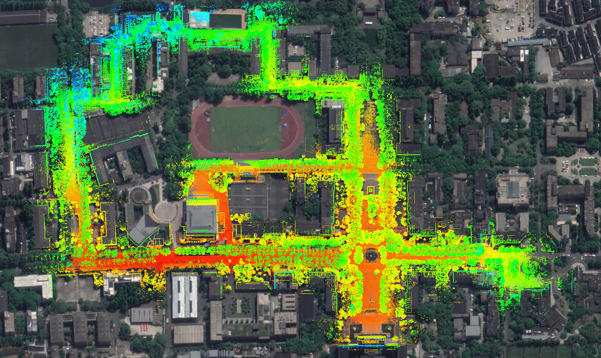

# CLINS
## News
As we are busy with other stuff recently, we will find time to clean up the code. The code will be open source before the Chinese Lunar New Year.

## Introduction
CLINS: Continuous-Time Trajectory Estimation for LiDAR-Inertial System

**CLINS** is a highly-accurate continuous-time trajectory estimation framework dedicated for SLAM (Simultaneous Localization and Mapping) applications, which enables fuse high-frequency and asynchronous sensor data effectively.  Now CLINS is applied in a 3D LiDAR-inertial system for evaluations.

The source code will be available after the publication of the related paper.

Supplementary Video: https://youtu.be/7aQJklHg2RM

## High resolution images in paper

Fig1: Dense 3D reconstruction of Kaist-Urban-07 dataset by simply assembling 2D LiDAR scans from SICK LMS-511 with the estimated continuous-time trajectory from CLINS.

Fig2: An illustration of the proposed continuous-time trajectory for LiDAR-inertial system based on cubic B-splines.

Fig3: An illustration of the two-stage continuous-time trajectory correction method for loop closures.

Fig4: The linear acceleration and angular velocity fitting results on \textit{fast1} sequence. Only the z-axis components are shown. Red is from the derivatives of the estimated continuous-time trajectory, while blue is from the raw IMU measurements.

Fig5: The unmanned ground vehicle with self-assembled sensors rigidly mounted. Sensors with red box are used to collect YQ sequences in campus.

Fig6: Top: Trajectory comparison with different methods on YQ-01 sequence. The red star indicates the start position and the end part of the trajectory are shown in zoom view. Bottom: Mapping results of CLINS with loop correction using YQ-01 Sequence. The map is consistent with the Google Earth imagery.

Fig7: Mapping results of CLINS using the garden, walking and small campus datasets from left to right, respectively. All are colored with reflective intensity.

